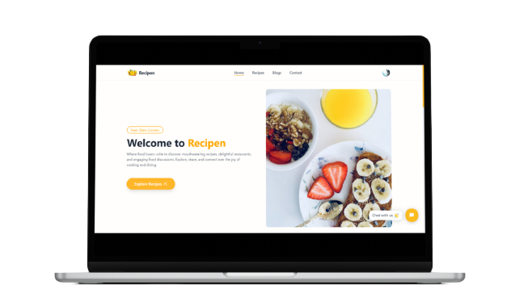

<div id="top">
<h1 align="center">CulinaryHub</h1>

<div align="center">

<h3>📝 Description :</h3>
Welcome to CulinaryHub – a recipe sharing website for food enthusiasts to explore, create, and share their culinary experiences. Indulge in a community-driven platform where food enthusiasts share their cherished recipes and captivating food blogs. Subscribe to the pro version to share your own recipes and to unlock a realm of taste, culture, and creativity.

<div align="center">

</div>

<br>
### Steps to run the project on your local machine

<ol>
<li>Fork this repository</li>
<li>Open terminal or command prompt on your local machine. Run the following command to clone the repository:</li>

```
git clone https://github.com/your-username/your-repo.git
```

Replace **your-username** with your GitHub username and **your-repo** with the name of your repository.

<li>Open the project and rename <strong>.env.example</strong> files to <strong>.env</strong> in both client and server directory.</li>

<li>Add your own environment variables to these both files.</li>

<li>Add <strong>http://localhost:5173</strong> and <strong>http://localhost:5000</strong> to <strong>allowedOrigins</strong> array present in the path <strong>server/config/allowedOrigins.</strong></li>

<li>To run the frontend, open a new terminal and run 'cd client/' to go to client directory and execute:</li>

```
npm run dev
```

<li>To run the backend, open a new terminal and run 'cd server/' to go to server directory and execute:</li>

```
nodemon index.js
```

<li>Open <strong>http://localhost:5173/</strong>strong> from your browser to run the webapp.</li>
</ol>
<br>
</div>
